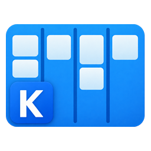
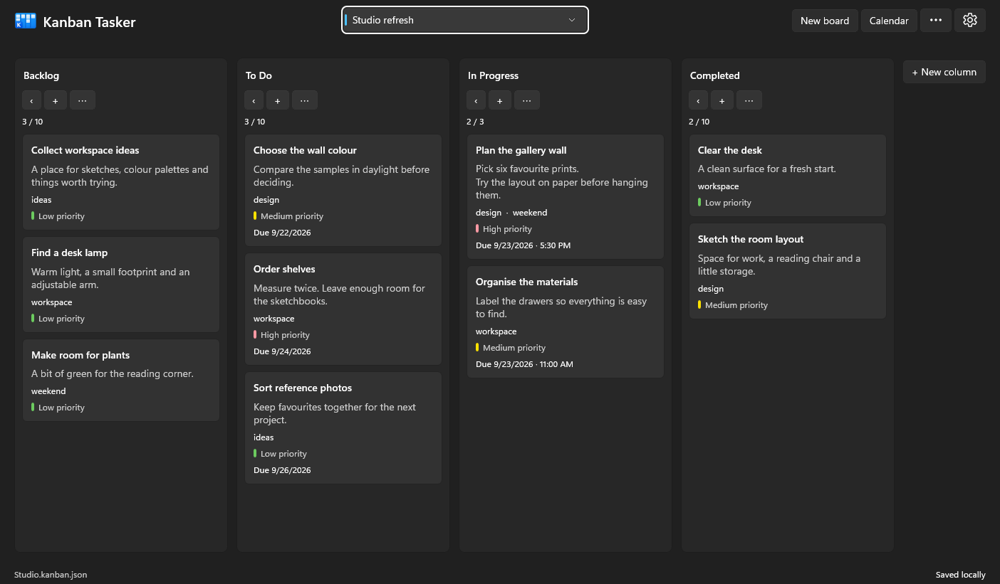
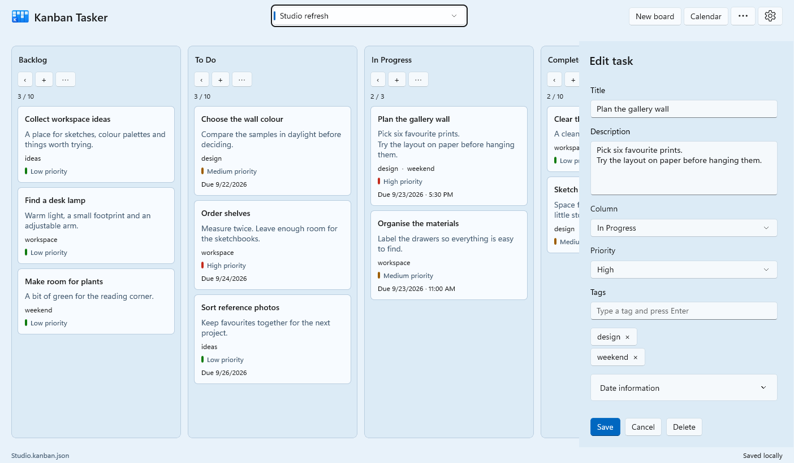
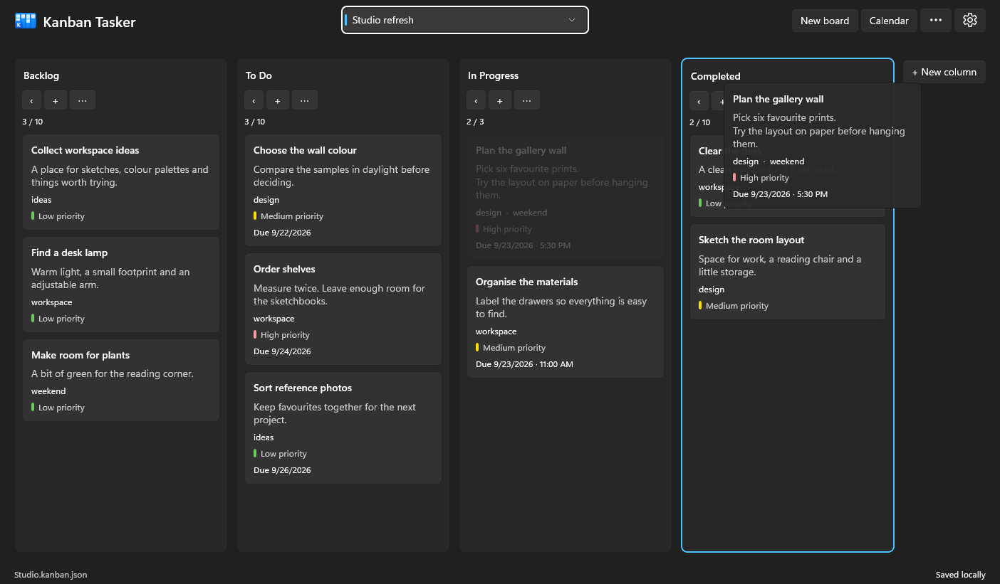
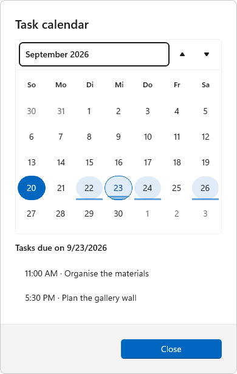
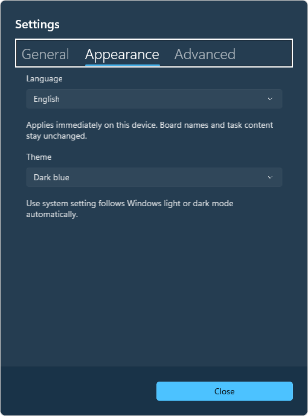
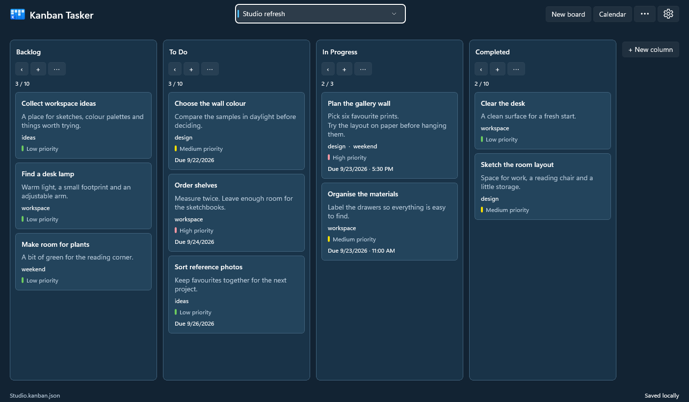
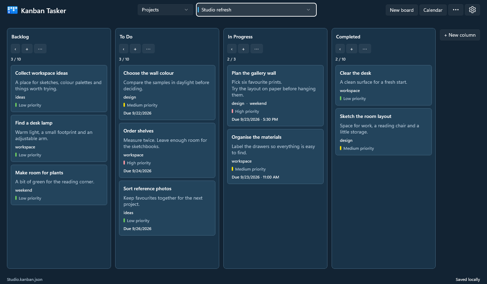

  

# Kanban Tasker

A pragmatic Windows kanban app for your own projects. Organise tasks, keep track of due dates and take your boards between devices using one local JSON file. No account required.

**Windows 10 & 11 · x64 & ARM64 · Five languages · MIT license**

An independent edition of [Hunter Johnson's original Kanban Tasker](https://github.com/hjo12/kanban-tasker-uwp), with a WinUI 3 interface and local file storage.

## Features

- **Boards for different projects.** Add board notes and customise, reorder or collapse columns. Optional column limits help you keep work in progress under control.
- **Optional [board groups](#board-groups).** Separate Work, Personal or other areas with a second dropdown. Enable it in Settings → Advanced; groups travel with your data file.
- **Cards with the details you need.** Descriptions, priorities, tags, start/finish dates, due dates and Windows reminders.
- **Drag cards and columns.** The item follows the pointer as you move it. Drop cards between tasks or on a column heading; movement is also available through context menus.
- **A calendar at a glance.** Days with due tasks are highlighted. Select a day to see its tasks, then open a task to edit it.
- **Make it comfortable.** Follow the system theme or choose Dark, Light, Light blue or Dark blue. Windows contrast themes are respected.
- **Five interface languages.** English, Deutsch, Español, Français and Italiano. Your board names and task content stay as you wrote them.
- **Your boards in one file.** Work offline, keep the JSON wherever you choose and optionally let Nextcloud or another file-sync client transfer it.

## A closer look

Edit a task beside the board, with its description, priority and tags together. Shown in **Light blue**.

Move a card to another column. Dropping on the heading places it before the first card.

| See what is due | Choose your language and theme |
| --- | --- |
|  |  |

See the Dark blue theme

*Screenshots use fictional demo data from the actual app. The example has a customised four-column workflow.*

## Installation

Choose the **Setup.exe** matching your PC: **x64** for Intel/AMD, or **ARM64** for Windows on ARM. Close Kanban Tasker, run Setup and follow the prompts. The required runtimes are included.

Setup adds the app to Start and offers a desktop shortcut, launch after installation and taskbar pinning. Windows may ask you to confirm pinning. Current test installers use a private signing certificate and need administrator approval once per PC to trust it.

Public release downloads and a Microsoft Store listing are not published yet. A source checkout contains no installers; see [Development](DEVELOPMENT.md) to build them. This edition can be installed alongside the original Store app; it does not import the original app's database.

## Getting started

1. Choose **Create data file** or **Open data file**. The suggested name is `KanbanTasker.kanban.json`.
2. Create a board. New boards start with Backlog, To Do, In Progress, Review and Completed, with a limit of ten tasks per column.
3. Use **+** to add a task, or click a card to edit it. Select **Save** to keep changes. Moves and other completed actions save automatically; unfinished forms remain local drafts.
4. Open **Settings → Appearance** to choose a language or theme. **Settings → General** lets you switch data files.

Column limits are visual warnings, not hard restrictions. Setting a limit to zero removes it. Windows reminders require an installed app and depend on your Windows notification settings.

Data files use **format 2**. Earlier development files are not imported or converted; create a new data file for this version. All devices opening the same file need a version that supports this format.

## Board groups

Keep work, personal plans or other areas in separate groups. A second dropdown to the left of the board selector filters the available boards.

1. Open **Settings → Advanced** and turn on **Enable board groups**. The feature is off by default.
2. Create your groups there, then assign a group when creating or editing a board.
3. Choose a group from the new dropdown. **All boards** shows everything; **Ungrouped** shows boards without a group.

You can rename or delete groups in **Advanced**. Deleting a group keeps its boards and tasks under **Ungrouped**. Turning the feature off hides the selector without removing groups or assignments.

Groups and board assignments are saved in your JSON file and travel with it. Whether the feature is enabled and which group is selected are preferences for each device.

## Moving between your devices

Save the JSON in a locally available Nextcloud folder or another synchronised folder. Open that file on each device and mark it **always available locally/offline**.

This is a **solo client**, for working on one device at a time. Before switching:

1. Save your work and close the app on the first device.
2. Wait for its sync client to finish uploading.
3. Wait for the other device to finish downloading, then open Kanban Tasker there.

**Saved locally** confirms the local write, not a completed cloud transfer. Simultaneous editing and real-time collaboration are not supported; your sync client can report conflicts if devices edit at the same time.

The app retains merge and local recovery safeguards for delayed or overlapping files. Recovery is not a backup history. If saving fails, check the displayed status before closing or switching devices. Keep regular backups of the data file for protection against accidental deletion.

## Development and contributions

See [DEVELOPMENT.md](DEVELOPMENT.md) for prerequisites, source layout, builds, tests, packaging, screenshot generation and guidance for forks.

Report bugs and feature requests in [this repository's Issues](https://github.com/Graphsto/Kanban-Tasker-Solosync/issues). For security findings, follow [SECURITY.md](SECURITY.md). Please use example data when reporting a problem.

## Privacy and license

There is no account, built-in cloud connection or telemetry service. The workspace is an unencrypted local JSON file; any cloud transfer is handled by the sync provider you choose. Device preferences and recovery data are stored separately in the local app profile.

[MIT licensed](LICENSE). Original application and image assets: copyright 2019 hjohnson12. [Original Repository](https://github.com/hjo12/kanban-tasker-uwp). The original attribution is preserved; this edition is not affiliated with or endorsed by the original author. Dependencies retain their own terms; see [third-party notices](THIRD-PARTY-NOTICES.md).
